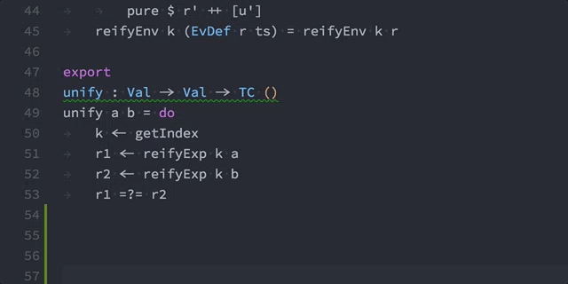

### Typecheck the open file

### Show the type of an identifier

### Show the documentation for an identifier

### Show the definition of an identifier

### List all currently active holes

### Generate an initial pattern match clause

### Generate an initial pattern match clause when trying to prove a type

### Generate a case split for a pattern variable

### Attempt to fill out holes by proof search

### Create a with-rule pattern match template for a clause of a function

### Create a case pattern match template for a hole

### Create a top level function with a type which solves the hole under the cursor

### Search names, types and documentation

### Evaluate the selected code

### Start or Refresh the REPL

### Send the selected code to the REPL

### iPKG completion

### Code completion

### Show type definition on hover

### Cleanup Idris binary files (*.ibc)

### Go to Definition and Peek Definition

### Go to Symbol (Outline symbols in currently open file)

### Search Symbol (Outline symbols in currently open project)

### Find All References

### Rename Symbol

### Change all occurrences

### Latex snippets

### Literate Idris

### Typecheck on file save

### Create a new project, with scaffolding

### Search for a function by type signature

### Highlight symbols matching the selected symbol

### Parameter hints

