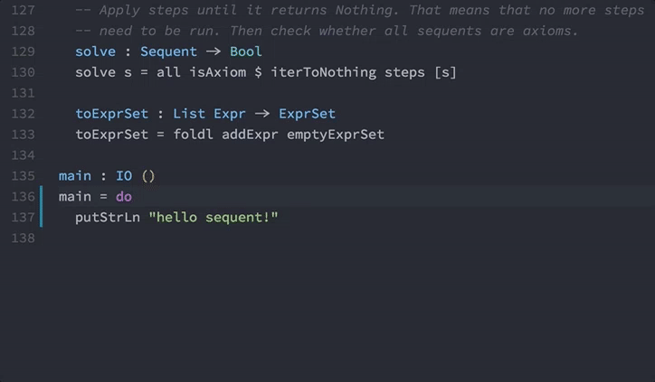

# Idris for Visual Studio Code

[](https://marketplace.visualstudio.com/items?itemName=zjhmale.Idris)
[](https://marketplace.visualstudio.com/items?itemName=zjhmale.Idris)
[](https://marketplace.visualstudio.com/items?itemName=zjhmale.Idris)

[](https://travis-ci.org/zjhmale/vscode-idris)
[](https://ci.appveyor.com/project/zjhmale/vscode-idris)

## Implemented features

Check out [FEATURES.md](https://github.com/zjhmale/vscode-idris/blob/master/FEATURES.md) to see screenshots for implemented features.

| command | shortcut |
|---|---|
| Typechecking | shift + cmd/ctrl + alt + t |
| Show the types of a variable | shift + cmd/ctrl + alt + o |
| Show the doc for a variable | shift + cmd/ctrl + alt + d |
| Show the doc for a definition | shift + cmd/ctrl + alt + f |
| Show holes | shift + cmd/ctrl + alt + h |
| Add clause | shift + cmd/ctrl + alt + a |
| Split case | shift + cmd/ctrl + alt + c |
| Search proof | shift + cmd/ctrl + alt + s |
| Make with | shift + cmd/ctrl + alt + w |
| Make case | shift + cmd/ctrl + alt + m |
| Make lemma | shift + cmd/ctrl + alt + l |
| Apropos | shift + cmd/ctrl + alt + k |
| Eval selected code | shift + cmd/ctrl + alt + e |
| Start / Refresh REPL | shift + cmd/ctrl + alt + r |
| Send selected code to REPL | shift + cmd/ctrl + alt + x |
| Cleanup Idris binary files | shift + cmd/ctrl + alt + u |

**Heads up:** All the command above can also be triggered in the right-click menu



* ipkg highlighting
* Auto-completion
* Show type definition on hover
* Type checking on saving file
* `Go to Definition` and `Peek Definition`
* Go to Symbol (Outline symbols in currently opend file)
* Search Symbol (Outline symbols in currently opend project)

## Installation

1. Within Visual Studio Code, open the command palette (Ctrl-Shift-P / Cmd-Shift-P).
2. Select `Install Extension` and search for 'Idris' or run `ext install Idris`.
3. [Download Idris](https://www.idris-lang.org/download/) and make sure the `idris` executable is on your `PATH`.

## Contributing

Check out [CONTRIBUTING.md](https://github.com/zjhmale/vscode-idris/blob/master/CONTRIBUTING.md).

## Options

The following Visual Studio Code settings along with their *default* values that are available for the Idris extension. If you want to change any of these, you can do so in user preferences (`cmd+,`) or workspace settings (`.vscode/settings.json`). You don't have to copy these if you don't intend to change them.

```javascript
{
    "idris.executablePath": "idris", // The full path to the idris executable.
    "idris.hoverMode": "fallback",   // Controls the hover behavior. 'info' will display Idris documentation, 'type' will display Idris type, 'fallback' will try 'info' first and fallback to 'type' if we can not get the documentation, and 'none' will disable hover tooltips.
    "idris.suggestMode": "allWords"  // Controls the auto-completion behavior. 'allWords' will always include all words from the currently opened documentation, 'replCompletion' will get suggestions from Idris REPL process.
}
```

## Acknowledgements

* Internal design is inspired by [atom-language-idris](https://github.com/idris-hackers/atom-language-idris).

## License

[BSD 3-Clause](https://opensource.org/licenses/BSD-3-Clause), the same as Idris.
