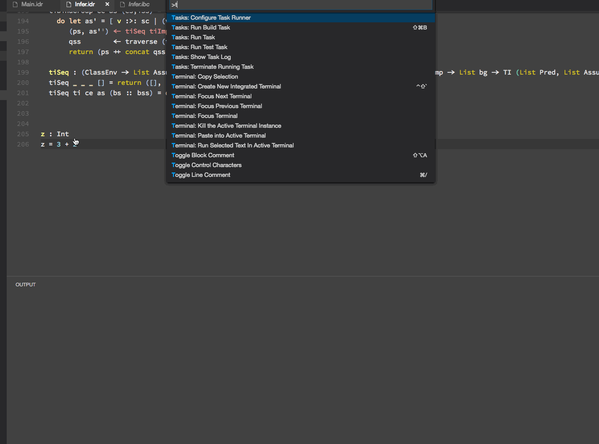
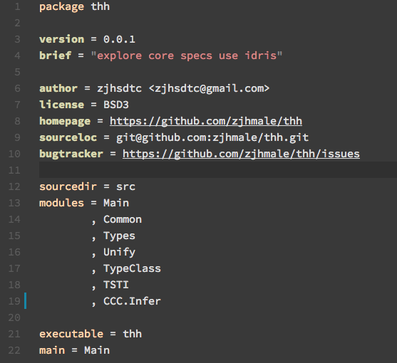

# Idris for Visual Studio Code

## Implemented features

### typechecking

`(shift + cmd/ctrl + t)`

### Showing the type of an identifier

`(shift + cmd/ctrl + o)`

### Showing the docs for an identifier

`(shift + cmd/ctrl + d)`

### Showing the definition for an identifier 

`(shift + cmd/ctrl + f)`

### List all the currently active holes

`(shift + cmd/ctrl + h)`

### Generate an initial pattern match clause

`(shift + cmd/ctrl + a)`

### Generate a case split for the pattern variable

`(shift + cmd/ctrl + c)`

### Attempt to fill out the holes by proof search

`(shift + cmd/ctrl + s)`

### Create a with rule pattern match template for the clause of function

`(shift + cmd/ctrl + w)`

### Create a case pattern match template for the holes

`(shift + cmd/ctrl + m)`

### Create a top level function with a type which solves the hole under the cursor

`(shift + cmd/ctrl + l)`

### Search names, types and documentation

`(shift + cmd/ctrl + k)`

### REPL

seriously, it is not a real `REPL` at the moment, it can only eval current line, more details [here](https://github.com/zjhmale/vscode-idris/issues/3).

`(shift + cmd/ctrl + r)`

### ipkg highlighting

## Installation

not release yet.

